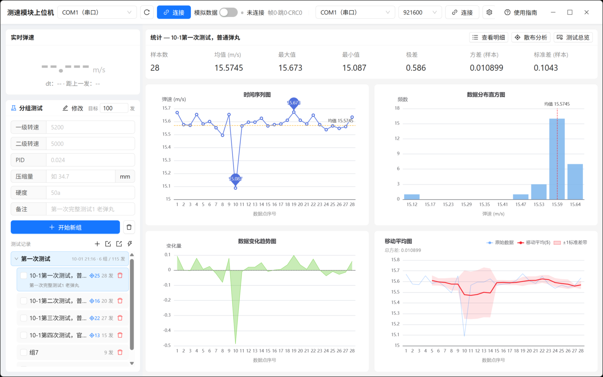
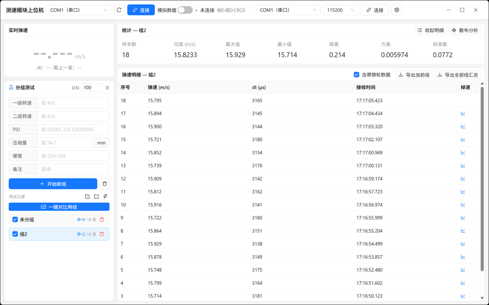
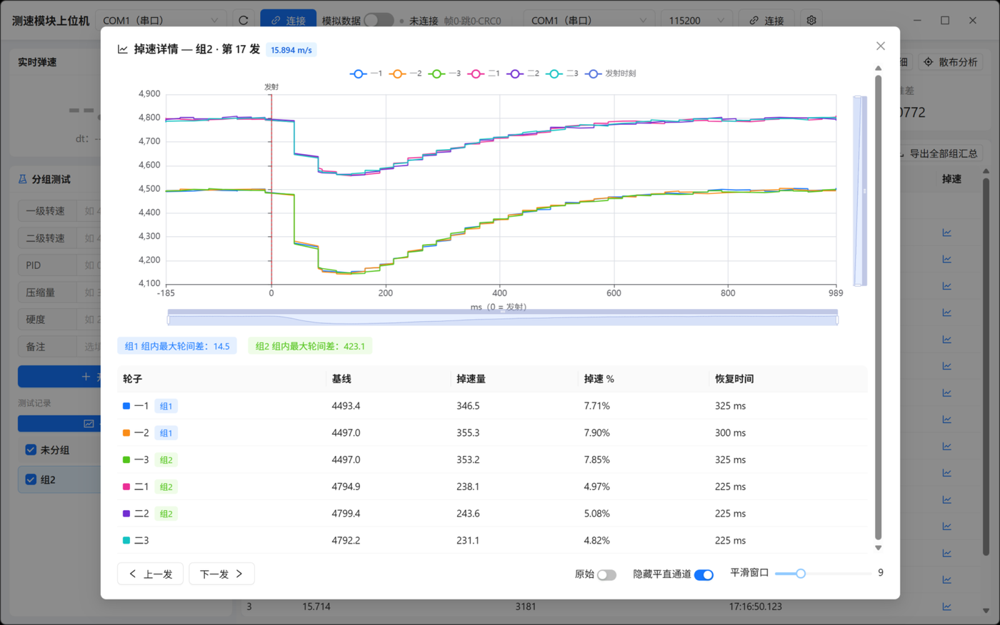
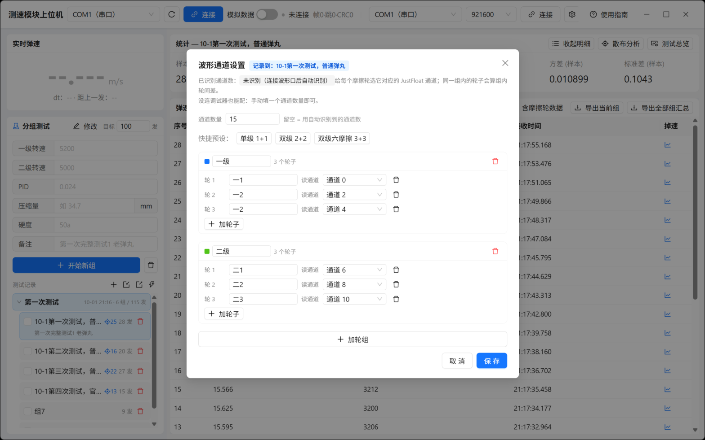
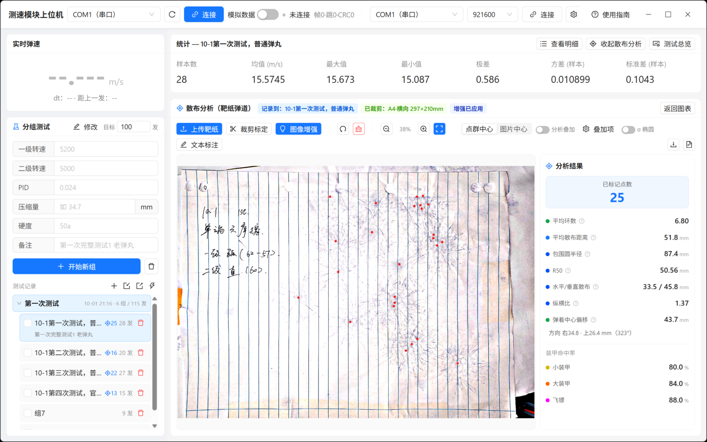
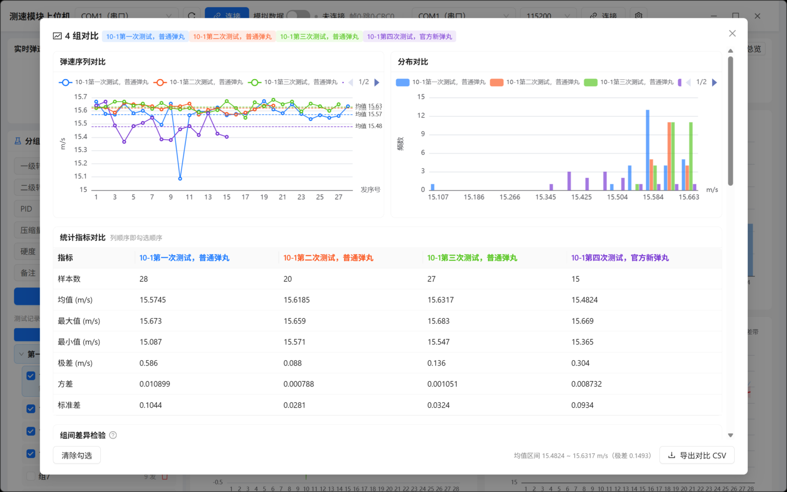

# rm-chronograph-host

RoboMaster 摩擦轮测速模块的桌面可视化上位机 —— 弹速采集、分组测试统计、摩擦轮掉速分析与靶纸散布分析，一个窗口全搞定。

Tauri v2 + React + TypeScript + Ant Design + ECharts，Windows 原生安装包（NSIS / MSI）。



## 功能

### 实时弹速与分组测试

串口接入双光电门测速模块，实时显示弹速、`dt`、距上一发间隔；按组记录一级/二级转速、PID、压缩量、摩擦轮硬度等参数，带目标发数进度提醒，每组的发射数据自动归档。

### 统计分析

样本数、均值、最值、极差、方差、标准差实时更新，四张图联动：时间序列（均值线 + 最值标注）、分布直方图、逐发变化趋势、移动平均 ±1σ 带。



### 摩擦轮掉速分析

第二个串口读 VOFA+ JustFloat 波形（通道数自适应，波特率可配），每发弹丸击发瞬间自动截取 **发射前 200ms ~ 后 1000ms** 的转速快照：

- 点击明细表任意一行，看该发的掉速/恢复曲线，多通道彩色区分
- 每条曲线可离线平滑（居中滑动平均，窗口可调）或看原始数据
- 每轮给出**基线、掉速量、掉速%、恢复时间**，并计算**组内最大轮间差**
- 通道可任意指派给摩擦轮组（内置单级 1+1 / 双级 2+2 / 双级六摩擦 3+3 预设）





### 靶纸散布分析

传一张靶纸照片，裁剪标定纸面尺寸（A4/A5/A3/Letter/Legal，默认横向），点出弹孔即可：

- 平均环数、平均散布距离、最小包围圆半径、小装甲/大装甲/飞镖命中率
- 可打开分析叠加查看环圈、包围圆、中心标记，标点时也可关闭以免遮挡
- 文字标注、保存标注图 PNG、导出结果 JSON
- **分析结果记在所属组上**，切换组自动切换靶纸，随会话与项目文件一起保存



### 数据持久化与多组对比

数据自动落盘（含每发波形与靶纸），重启即恢复，可跨多次测试、多天积累；也可导出 `.rmtest` 项目文件备份或发给队友。

测试记录里勾选**任意多组**（不再限制两组）→ **一键对比**：弹速序列叠加、分布直方图叠加（共用分箱）、统计指标并排、摩擦轮平均掉速%与轮间差并排、**靶纸落点用不同颜色半透明圆形叠加**（含弹着中心与散布指标）。

- 勾选两组时额外给 **差值 / 95% 置信区间 / p 值**（均值 Welch t 检验，极差与标准差用 bootstrap 重采样）。
- 勾选三组及以上时给 **组间差异检验**（均值 Welch ANOVA 不要求方差相等；极差/标准差用 1000 次置换检验）与 **均值两两 Welch t 检验矩阵**（未做多重比较校正）。
- 结果可导出 CSV（每组一列，含配对检验与落点明细）。



### 其他

- 明细/汇总 CSV 导出（可选附带每发摩擦轮掉速指标）
- 无边框沉浸窗口 + 自定义窗口按钮，布局全自适应
- 内置**模拟数据**开关，无硬件也能演示全部功能

## 安装

到 [Releases](../../releases) 下载：

- `rm-chronograph-host_x.x.x_x64-setup.exe`（NSIS 安装包，推荐）
- `rm-chronograph-host_x.x.x_x64_en-US.msi`（MSI）

Windows 10/11 x64。首次运行若被 SmartScreen 拦截，选"更多信息 → 仍要运行"。

## 快速上手

1. 插上测速模块，顶栏选串口号 → **连接**；状态变"在线"后每过一发就会记录
2. 左侧填好本组参数（转速/PID/压缩量/硬度）→ **开始新组**，打完后**结束本组**
3. 要分析掉速：把摩擦轮控制板的调试串口接到"波形口"，选波特率 → **连接**，再点 ⚙ 把通道指派到各摩擦轮
4. 要分析靶纸：右上角 **散布分析** → 上传靶纸 → 裁剪标定 → 点弹孔
5. 勾选两组 → **一键对比**；或直接导出 CSV

没有硬件时打开顶栏 **模拟数据**，所有界面（含波形与散布）都能跑起来。

## 开发

```bash
pnpm install          # 或 npm install
pnpm tauri dev        # 开发调试（前端热更新）

pnpm test             # 前端单元测试（vitest）
cd src-tauri && cargo test   # 协议解析测试

pnpm tauri build      # 打包，产物在 src-tauri/target/release/bundle/
```

## 串口协议

**测速口**（115200 8N1，固定）：

| 内容 | 格式 |
| --- | --- |
| 心跳 | 单字节 `0x48`，约 100ms 一次 |
| 数据帧 | `0x36 \| speed_milli_mps(u32 LE) \| dt_us(u32 LE) \| CRC8`，固定 10 字节 |

离线判定：连续 500ms 无心跳/数据帧。CRC8 为 DJI/RM 查表实现（多项式 0x31 反射为 0x8C、初值 0xFF、LSB-first），覆盖前 9 字节。

**波形口**（波特率可配，默认 115200）：VOFA+ JustFloat —— N 个 `float32` 小端通道 + 尾帧 `00 00 80 7F`，通道数自适应。

## 目录结构

```
host_computer/
├─ src/                    前端
│  ├─ components/          界面组件（图表、明细、散布、对比…）
│  ├─ dispersion/          靶纸散布算法（纯函数 + 单测）
│  ├─ protocol_ts.ts       测速协议解析（与 Rust 侧一致）
│  ├─ justfloat.ts         JustFloat 流式解析
│  ├─ wave.ts              波形缓冲、快照、平滑、掉速指标
│  ├─ persist.ts           会话序列化（波形 float32→base64 压缩）
│  ├─ compare.ts           两组对比计算
│  └─ csv.ts               CSV 导出
└─ src-tauri/              Rust 后端（串口收发、文件读写）
```

## License

MIT
